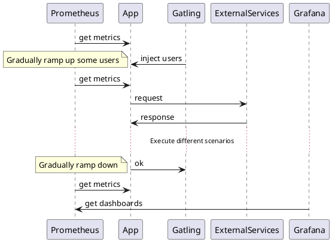

# sandbox
Docker compose sandbox to help you troubleshoot performance issues.

```puml
@startuml
Prometheus -> App : get metrics
Gatling -> App : inject users
note left
  Gradually ramp up some users
end note
Prometheus -> App : get metrics
App -> ExternalServices : request
ExternalServices -> App : response
... Execute different scenarios ...
App -> Gatling : ok
note left
  Gradually ramp down
end note
Prometheus -> App : get metrics
Grafana -> Prometheus : get dashboards
@enduml
```
